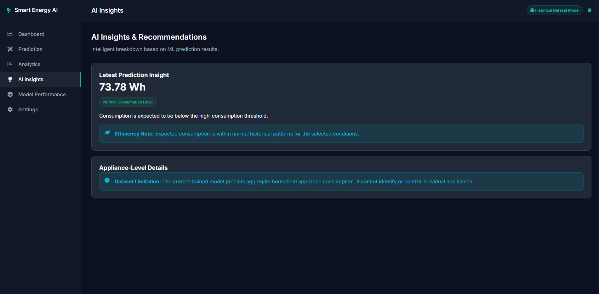
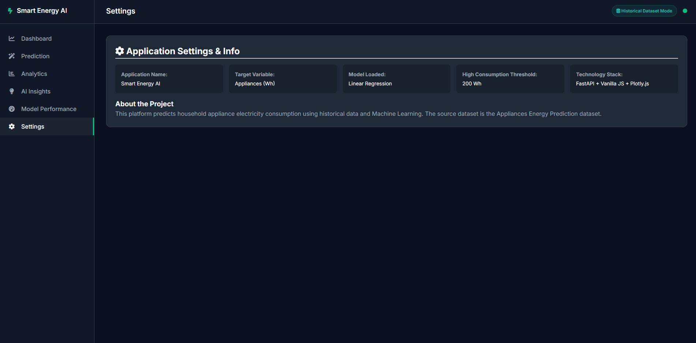
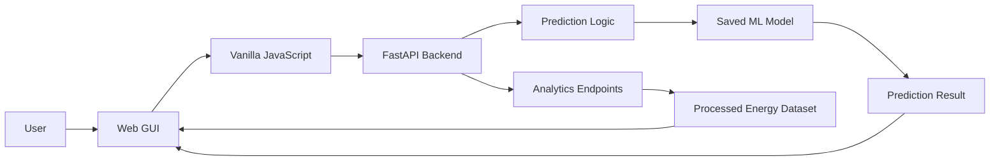
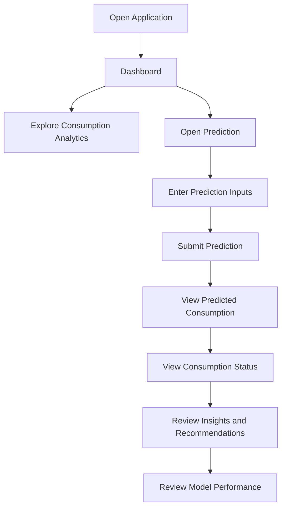

# Smart Energy AI

## Project Overview

Smart Energy AI is a machine learning system that **predicts household appliance energy consumption** (in Watt-hours) from indoor environmental sensor data, outdoor weather conditions, and time of day.

The project is built as a complete academic ML pipeline: data cleaning → EDA → feature engineering → model training → evaluation → hyperparameter tuning → deployment.

---

## Problem Statement

Household residents typically have no way to anticipate how much electricity their appliances will consume or when consumption will spike. This project builds a regression model that predicts `Appliances` energy use (Wh) from sensor readings, enabling users to:

- Understand expected electricity consumption before it occurs
- Identify high-usage periods and take action to reduce them
- Build awareness of the environmental conditions that drive energy use

---

## Project Goal

Train and deploy a regression model that accepts real-world sensor readings and returns a predicted appliance energy consumption in Watt-hours (Wh), together with a binary indicator of whether the predicted consumption is high.

---

## Machine Learning Task

| Task | Details |
|---|---|
| **Primary task** | Regression — predict `Appliances` energy use in Wh |
| **Secondary task** | Binary classification — identify high-consumption periods |
| **Reason for secondary task** | The instructor requires Accuracy, Precision, Recall, F1, and ROC-AUC |

---

## Dataset

| Property | Value |
|---|---|
| **Name** | Appliances Energy Prediction Data Set |
| **Source** | [Kaggle](https://www.kaggle.com/datasets/sohommajumder21/appliances-energy-prediction-data-set) |
| **Observations** | 19,735 rows |
| **Columns** | 29 columns |
| **Collection period** | January 11 – May 27, 2016 |
| **Collection frequency** | Every 10 minutes |
| **Target variable** | `Appliances` — household appliance energy consumption (Wh) |

---

## Features

### Original Features (29 columns)

| Feature | Description | Unit |
|---|---|---|
| `date` | Date and time of observation | Timestamp |
| `Appliances` | Household appliance energy use (target) | Wh |
| `lights` | Energy used by lighting fixtures | Wh |
| `T1` | Kitchen temperature | °C |
| `RH_1` | Kitchen humidity | % |
| `T2` | Living room temperature | °C |
| `RH_2` | Living room humidity | % |
| `T3` | Laundry room temperature | °C |
| `RH_3` | Laundry room humidity | % |
| `T4` | Office room temperature | °C |
| `RH_4` | Office room humidity | % |
| `T5` | Bathroom temperature | °C |
| `RH_5` | Bathroom humidity | % |
| `T6` | Outside north side temperature | °C |
| `RH_6` | Outside north side humidity | % |
| `T7` | Ironing room temperature | °C |
| `RH_7` | Ironing room humidity | % |
| `T8` | Teenager room 2 temperature | °C |
| `RH_8` | Teenager room 2 humidity | % |
| `T9` | Parents room temperature | °C |
| `RH_9` | Parents room humidity | % |
| `T_out` | Outdoor temperature | °C |
| `Press_mm_hg` | Atmospheric pressure | mm Hg |
| `RH_out` | Outdoor humidity | % |
| `Windspeed` | Wind speed | m/s |
| `Visibility` | Visibility | km |
| `Tdewpoint` | Dew point temperature | °C |
| `rv1` | Random variable 1 (noise) | — |
| `rv2` | Random variable 2 (noise) | — |

### Final Model Features (19 features)

15 original sensor features selected by Random Forest importance (computed on training data only):

`lights`, `RH_out`, `Press_mm_hg`, `RH_1`, `RH_2`, `RH_8`, `RH_5`, `T3`, `RH_3`, `RH_6`, `T4`, `T8`, `RH_7`, `RH_4`, `T5`

Plus 4 engineered time features:

`hour`, `day_of_week`, `month`, `is_weekend`

---

## Data Cleaning

| Check | Result |
|---|---|
| Duplicate rows | 0 found |
| Missing values | 0 found |
| Invalid dates | 0 after using `dayfirst=True` |
| Negative energy values | 0 found |
| Outliers (IQR method) | Retained — represent legitimate high-consumption events |
| Cleaned dataset | `data/processed/energydata_cleaned.csv` |

---

## EDA Highlights

- The `Appliances` target is **right-skewed** (skewness ≈ 3.39): most observations fall in a moderate range (median ≈ 60 Wh), with occasional spikes up to 1080 Wh
- Average consumption peaks in the **evening hours** (consistent with cooking and other household activities)
- Consumption is **lower in warmer months** (lower heating demand)
- Individual feature correlations with the target are weak (< 0.2), suggesting non-linear relationships that benefit from ensemble models

---

## Feature Engineering

Four interpretable time-based features were created from the `date` column:

| Feature | Description | Why useful |
|---|---|---|
| `hour` | Hour of day (0–23) | Captures the daily usage cycle (highest importance) |
| `day_of_week` | Day of week (0=Monday) | Weekday vs. weekend patterns |
| `month` | Month of year (1–12) | Seasonal heating/cooling patterns |
| `is_weekend` | 1 if Saturday/Sunday | Weekend activity patterns differ from weekdays |

**PCA:** 11 components were needed to retain 95% of variance in the 19-feature set. PCA was **not applied** in the final model to preserve interpretability.

---

## Models

Three regression models were trained using a **chronological 80/20 train/test split**:

| Model | Preprocessing |
|---|---|
| Linear Regression | StandardScaler applied |
| Random Forest Regressor | Raw features (no scaling needed) |
| Gradient Boosting Regressor | Raw features (no scaling needed) |

**Cross-validation:** `TimeSeriesSplit` (3 splits) on the training set only.

---

## Evaluation Results

### Regression Metrics

| Model | CV RMSE (train) | MAE | RMSE | R² |
|---|---|---|---|---|
| **Linear Regression** | 102.17 | 52.67 | 87.92 | 0.0673 |
| Random Forest | 101.36 | 110.00 | 148.71 | -1.6683 |
| Gradient Boosting | 107.13 | 121.78 | 162.19 | -2.1739 |

**Note:** Tree-based models show a distribution-shift effect — the training period (January–April) is cooler than the test period (late April–May), causing the models to overestimate consumption in the test set.

### Hyperparameter Tuning

Tuned Random Forest with `RandomizedSearchCV` + `TimeSeriesSplit`:

- **Best params:** `n_estimators=160, max_depth=15, min_samples_leaf=10, max_features='sqrt'`
- Baseline RF RMSE: 148.71 → Tuned RF RMSE: **118.44** (improvement)
- Despite improvement, Linear Regression still generalizes better on this test period

### Secondary Classification Metrics

Binary task: predict whether consumption exceeds **210 Wh** (90th percentile of training set)

| Metric | Value |
|---|---|
| Accuracy | 0.9199 |
| Precision | 0.2000 |
| Recall | 0.0032 |
| F1-score | 0.0063 |
| ROC-AUC | 0.7336 |

---

## Best Model

**Linear Regression** — the only model with a positive R² on the chronological test set. Selected for deployment because it generalizes best across the seasonal distribution shift between the training and test periods.

---

## Project Structure

```
Smart-Energy-AI/
├── data/
│   ├── processed/
│   │   └── energydata_cleaned.csv     # Cleaned dataset (29 cols, 19,735 rows)
│   └── raw/
│       └── energydata_complete.csv    # Original raw dataset (do not modify)
├── models/
│   └── final_model.joblib             # Saved model + scaler + feature list
├── notebooks/
│   └── smart_energy_ai.ipynb          # Complete end-to-end notebook
├── reports/                           # Report outputs (plots, summaries)
├── src/
│   ├── data_preprocessing.py          # Data loading and cleaning utilities
│   ├── train.py                       # Training script (CLI runnable)
│   └── predict.py                     # Prediction utility
├── app.py                             # FastAPI REST API
├── requirements.txt                   # Python dependencies
└── README.md                          # This file
```

---

## Web Application

The primary interface is a FastAPI application served at the root URL. It uses
HTML, CSS, Vanilla JavaScript, and Plotly.js. Dashboard values and charts are
derived from the historical dataset; the prediction form sends the real sensor
inputs to the saved model bundle. Date and time are converted server-side to
the four engineered time features used during training.


## Installation

```bash
# Create an isolated project environment
python -m venv .venv

# Install the web-app dependencies (Windows/MSYS2 setup)
.\.venv\bin\python.exe -m pip install -r requirements.txt
```

---

## How to Run

### 1. Run the Notebooks

```bash
jupyter notebook notebooks/smart_energy_ai.ipynb
```

This notebook runs the full end-to-end pipeline including data cleaning, EDA, feature engineering, model training, evaluation, and deployment.

### 2. Train the Model from Command Line

```bash
python src/train.py
```

This script:
- Loads `data/raw/energydata_complete.csv`
- Cleans and preprocesses the data
- Saves `data/processed/energydata_cleaned.csv`
- Trains three models and evaluates them
- Saves `models/final_model.joblib`

### 3. Run the FastAPI Web Application

```bash
.\.venv\bin\python.exe -m uvicorn app:app --reload --port 8000
```

Open **http://localhost:8000** for the dashboard. The API documentation is
available at **http://localhost:8000/docs**.

**Example API request:**

```bash
curl -X POST http://localhost:8000/predict \
  -H "Content-Type: application/json" \
  -d '{
    "T3": 21.0, "RH_3": 39.0, "Press_mm_hg": 755.0, "T8": 21.5,
    "RH_5": 50.0, "RH_2": 40.0, "lights": 0.0, "RH_4": 39.0,
    "T5": 19.5, "Tdewpoint": 4.0, "RH_6": 80.0, "RH_1": 40.0,
    "RH_8": 42.0, "RH_9": 41.0, "T7": 20.5,
    "hour": 18, "day_of_week": 1, "month": 3, "is_weekend": 0
  }'
```

**Example response:**

```json
{
  "predicted_appliances_wh": 63.69,
  "high_consumption_alert": false,
  "threshold_wh": 210.0
}
```

### 4. Run the Streamlit GUI

```bash
streamlit run streamlit_app.py
```

Then open **http://localhost:8501** in your browser.

The GUI provides:
- Input sliders/fields for all 19 features (organized by category)
- A **Predict** button
- Predicted energy consumption in Wh
- Consumption status: Normal or High

### 5. Run a Quick Prediction from Python

```python
from src.predict import predict

result = predict({
    "T3": 21.0, "RH_3": 39.0, "Press_mm_hg": 755.0, "T8": 21.5,
    "RH_5": 50.0, "RH_2": 40.0, "lights": 0.0, "RH_4": 39.0,
    "T5": 19.5, "Tdewpoint": 4.0, "RH_6": 80.0, "RH_1": 40.0,
    "RH_8": 42.0, "RH_9": 41.0, "T7": 20.5,
    "hour": 18, "day_of_week": 1, "month": 3, "is_weekend": 0
})
print(result)
# {'predicted_wh': 63.69, 'is_high': False, 'threshold_wh': 210.0}
```

---

## Limitations

1. **Seasonal distribution shift:** The dataset spans only 4.5 months (Jan–May). The test period (late April–May) has higher outdoor temperatures than the training period, causing tree-based models to overestimate consumption. Collecting data over a full year would reduce this effect.

2. **Low R² on test set:** Linear Regression achieves R² ≈ 0.067, indicating that the model captures only part of the variance in appliance consumption. The target has high noise and many unmeasured contributing factors.

3. **No occupancy information:** The dataset does not include occupancy counts or individual appliance labels, which limits predictive power.

4. **Single household:** The dataset comes from a single Belgian household and may not generalize to other households.

---

## Future Improvements

- Collect data over a full year to reduce the seasonal distribution-shift effect
- Add occupancy sensors as features
- Explore time-series specific models such as LSTM or Prophet
- Implement model monitoring to detect input drift from the training distribution
- Add individual appliance-level monitoring to improve interpretability


---

## Application Screenshots

The following screenshots are included directly from the current project and use repository-relative paths so they render correctly on GitHub.

### Dashboard

The main dashboard provides an overview of the application's energy data and key information.


### Prediction

The prediction interface allows users to provide the required inputs and request an appliance energy-consumption prediction.


### Prediction Result

The prediction result view presents the estimated appliance consumption and the corresponding consumption status.


### Model Performance

The Model Performance view presents the available evaluation information for the deployed model.


### AI Insights

The AI Insights interface presents consumption-related insights and recommendations available in the current application.



### Settings

The Settings page provides the available application and project information.



---

## Application Architecture



---

## User Workflow



---

## API Overview

The FastAPI backend provides the application's prediction and analytics functionality.

The current application includes functionality for:

- Application health checking
- Appliance energy-consumption prediction
- Historical consumption summaries
- Hourly consumption analytics
- Daily consumption analytics
- Weekly consumption analytics
- Monthly consumption analytics
- Model-performance evaluation

FastAPI also provides automatically generated interactive API documentation at:

```text
http://localhost:8000/docs
```

---

## Model Deployment

The trained model artifacts are stored in the `models/` directory.

```text
models/
├── final_model.joblib
└── scaler.joblib
```

The application loads the saved model artifacts when the FastAPI application starts and uses them for prediction requests.

The prediction workflow derives the required time-based features from the selected date and time before passing the prepared inputs to the model.

---

## Reproducibility

The project keeps the main stages of the machine learning workflow organized across notebooks and source files.

The main end-to-end notebook is:

```text
notebooks/smart_energy_ai.ipynb
```

The supporting notebooks cover:

```text
01_data_understanding.ipynb
02_eda.ipynb
03_model_training.ipynb
04_model_evaluation.ipynb
```

The source implementation is organized into:

```text
src/data_preprocessing.py
src/train.py
src/predict.py
```

This structure makes it possible to inspect the data preparation, training, evaluation, and prediction stages separately.

---

## Repository Documentation

Additional project documentation and generated outputs are organized under:

```text
docs/
reports/
PROJECT_PROGRESS.md
```

The application screenshots are stored specifically under:

```text
docs/screenshots/
```

All screenshot references in this README use relative repository paths. This means GitHub can resolve them after the repository is uploaded without requiring local Windows paths or external image hosting.

---

## Current Project Status

### Completed

- Real-world household energy dataset preparation
- Data quality checks
- Exploratory Data Analysis
- Time-based feature engineering
- Feature selection
- Chronological train/test split
- Regression model training
- Time-series cross-validation
- Random Forest hyperparameter tuning
- Model evaluation
- Best-model selection
- Saved model artifacts
- FastAPI backend
- HTML/CSS/Vanilla JavaScript web interface
- Plotly.js visualizations
- Energy-consumption prediction
- Historical consumption analytics
- Peak-hour analysis
- AI Insights and recommendations interface
- Model Performance interface
- Settings interface
- Application screenshots and project documentation

### Partially Completed

- Model Comparison is not currently available as a fully functional comparison view in the deployed application.
- The predictive performance is affected by the limited time coverage and distribution shift in the available dataset.

### Pending

- Full-year energy data collection
- Improved generalization across different households
- Additional predictive features such as occupancy information
- Advanced time-series models
- Model monitoring and drift detection
- Expanded appliance-level prediction
- A fully functional Model Comparison interface

---

## Future Improvements

- Collect data over a full year to reduce the seasonal distribution-shift effect
- Add occupancy sensors as features
- Explore time-series specific models such as LSTM or Prophet
- Implement model monitoring to detect input drift from the training distribution
- Add individual appliance-level monitoring to improve interpretability


